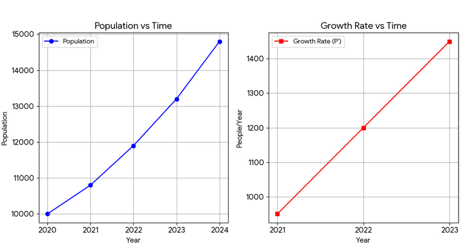
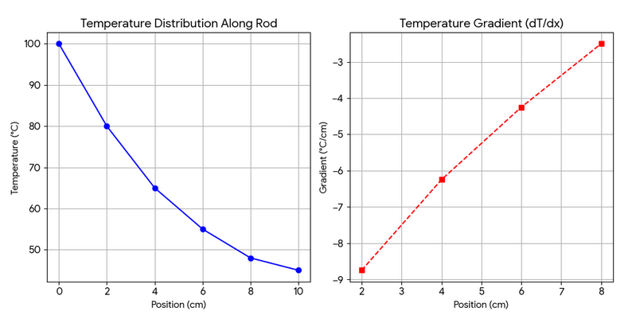
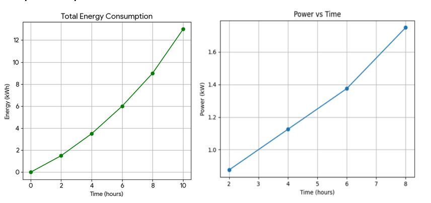

# Group3-Finals-Activity
This repository presents a comparative Case Analysis of Case 1, Case 3, and Case 5, focusing on the practical application of numerical methods in diverse fields.

## Prerequisites & Installation

Before running the simulation scripts (e.g., `POPULATION.py`), you must ensure Python is installed and install the required dependencies.

**1. Install PyQt6 (For GUI and Graphs):**
Open your terminal and run:
```bash
pip install PyQt6

## Case Analysis 1: Population Growth Analysis

### Overview
This study analyzes community population data from 2020 to 2024 to identify growth patterns and assist in urban resource planning.

### Data Presented
| Year | Population |
| :--- | :--- |
| 2020 | 10,000 |
| 2021 | 10,800 |
| 2022 | 11,900 |
| 2023 | 13,200 |
| 2024 | 14,800 |

### Formulas & Calculation
**Numerical Differentiation (Central Difference):**
$$f'(x) \approx \frac{f(x+h) - f(x-h)}{2h}$$
* **2021 Rate:** $(11,900 - 10,000) / 2 = 950$
* **2022 Rate:** $(13,200 - 10,800) / 2 = 1,200$
* **2023 Rate:** $(14,800 - 11,900) / 2 = 1,450$

**Numerical Integration (Trapezoidal Rule):**
$$I \approx \frac{h}{2} [f(x_0) + 2(f_1 + f_2 + f_3) + f(x_n)]$$
* **Total Change:** $\approx 49,450$ (Accumulated contribution)

### Graph & Analysis


* **Analysis:** The increase is not constant (non-linear). The growth rate is rising annually, suggesting exponential behavior.

### Conclusion
The study confirms accelerating growth. Proactive management is necessary to accommodate the increasing demand for public services.

---

## Case Analysis 3: Diffusion Process (Heat Spread)

### Overview
A simulation of heat distribution along a 10cm metal rod to analyze thermal decay and material stress points.

### Data Presented
| Position (cm) | Temp (°C) |
| :--- | :--- |
| 0 | 100 |
| 4 | 65 |
| 8 | 48 |
| 10 | 45 |

### Formulas & Calculation
**Numerical Differentiation (Gradient):**
$$\frac{dT}{dx} \approx \frac{T(x+h) - T(x-h)}{2h}$$
* **2cm Gradient:** $(65 - 100) / 4 = -8.75$ °C/cm
* **8cm Gradient:** $(45 - 55) / 4 = -2.50$ °C/cm

**Numerical Integration (Simpson's 1/3 Rule):**
$$I \approx \frac{h}{3} [f(x_0) + 4(f_{odd}) + 2(f_{even}) + f(x_n)]$$
* **Total Heat Distribution:** $607.33$ °C·cm

### Graph & Analysis


* **Analysis:** The cooling rate is highest near the source and slows down significantly as distance increases (exponential decay).

### Conclusion
Numerical modeling successfully identified that heat transfer is fastest near the source, providing critical data for heat-sink engineering.

---

## Case Analysis 5: Electricity Consumption

### Overview
Monitoring household energy usage (kWh) over 10 hours to identify peak usage periods and verify power demand.

### Data Presented
| Time (hrs) | Energy (kWh) |
| :--- | :--- |
| 0 | 0 |
| 4 | 3.5 |
| 8 | 9.0 |
| 10 | 13.0 |

### Formulas & Calculation
**Instantaneous Power (Differentiation):**
$$P(t) = \frac{dE}{dt}$$
* **4-hr Power:** $(6.0 - 1.5) / 4 = 1.125$ kW
* **8-hr Power:** $(13.0 - 6.0) / 4 = 1.75$ kW

### Graph & Analysis

* **Analysis:** Electricity usage accelerates over time. Peak demand occurs between hours 8 and 10.


### Conclusion
The study highlights the importance of monitoring peak hours. Strategies like using energy-efficient appliances during peak times can reduce costs and grid load.
